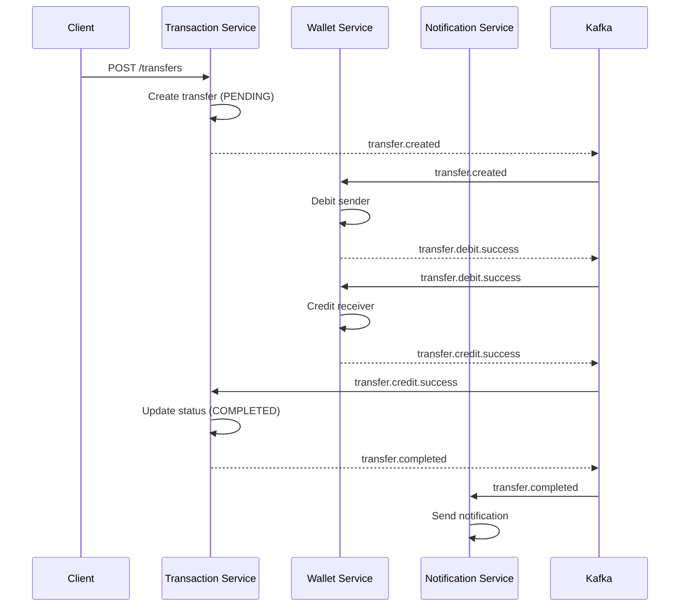

# SagaWallet 🏦

<div align="center">


**A production-ready distributed wallet system built with Go microservices, Saga Choreography, and deployed on GCP Cloud Run.**

[Features](#-features) • [Quick Start](#-quick-start) • [API](#-api-endpoints) • [Architecture](#-architecture) • [Docker](#-docker-deployment)

</div>

---

## ✨ Features

| Feature | Description |
|---------|-------------|
| 🔄 **Saga Pattern** | Event-driven choreography with automatic compensation (rollback) |
| ⚡ **High Performance** | Go's concurrency model for low-latency operations |
| 🔐 **User Authentication (JWT)** | Secure API endpoints with token-based auth |
| 🛡️ **Resource Ownership Authorization** | Wallet and transfer access is enforced by authenticated identity |
| 🔒 **Internal Service Authentication** | Wallet gRPC calls require `WALLET_GRPC_TOKEN` metadata |
| 🚦 **Rate Limiting** | Token bucket algorithm (100 req/min per IP) |
| 📊 **Prometheus Metrics** | Built-in `/metrics` endpoints for observability |
| 📨 **Event-Driven** | Kafka (Redpanda) based async communication |
| 💾 **ACID Transactions** | PostgreSQL with optimistic locking |

---

## 🚀 Quick Start

### Prerequisites

- Go 1.25
- Docker & Docker Compose
- gcloud CLI (for GCP deployment)
- Terraform (for IaC)
- Make (optional)

### Option 1: Run with Docker (Recommended)

```bash
# Clone the repository
git clone https://github.com/egesarisac/sagawallet.git
cd sagawallet

# Prepare environment variables
cp .env.example .env

# Start everything (databases, Kafka, all 4 services)
docker compose -f docker-compose.full.yml up --build
```

**Services will be available at:**
- Wallet Service: http://localhost:8081
- Transaction Service: http://localhost:8083
- Notification Service: http://localhost:8084
- Auth Service: http://localhost:8085
- Kafka UI: http://localhost:8080
- Prometheus: http://localhost:9090

### Option 2: Run Locally (Development)

```bash
# Start infrastructure only
make docker-up

# Run migrations (Wallet and Transaction services)
make migrate-wallet
make migrate-txn

# Run services in separate terminals
cd services/auth-service && go run cmd/main.go
cd services/wallet-service && go run cmd/main.go
cd services/transaction-service && go run cmd/main.go
cd services/notification-service && go run cmd/main.go
```

---

## 🔑 Security Model

User Authentication (JWT):
- All `/api/v1/*` endpoints require JWT authentication.

Internal Service Authentication:
- Internal gRPC calls between `transaction-service` and `wallet-service` use `WALLET_GRPC_TOKEN`.
- `WALLET_GRPC_TOKEN` is required in both services and must match.

Resource Ownership Authorization:
- Wallet read/write operations require ownership of the target wallet.
- Transfer creation requires authenticated ownership of `sender_wallet_id`.
- Transfer read requires authenticated user to be sender or receiver wallet owner.

For Docker Compose, define both secrets in `.env`:

```bash
JWT_SECRET=your-jwt-secret
WALLET_GRPC_TOKEN=your-internal-grpc-token
```

### Generate a Token

```bash
cd tools/tokengen && go run main.go
```

### Use the Token

```bash
curl -H "Authorization: Bearer <your-token>" \
  http://localhost:8081/api/v1/wallets/<wallet-id>
```

---

## 🌐 API Endpoints

### Wallet Service (`:8081`)

| Method | Endpoint | Auth | Description |
|--------|----------|------|-------------|
| `GET` | `/health` | ❌ | Health check |
| `GET` | `/metrics` | ❌ | Prometheus metrics |
| `POST` | `/api/v1/wallets` | ✅ | Create wallet |
| `GET` | `/api/v1/wallets/:id` | ✅ | Get wallet details |
| `GET` | `/api/v1/wallets/:id/balance` | ✅ | Get balance |
| `POST` | `/api/v1/wallets/:id/credit` | ✅ | Add funds |
| `POST` | `/api/v1/wallets/:id/debit` | ✅ | Withdraw funds |
| `GET` | `/api/v1/wallets/:id/transactions` | ✅ | Transaction history |
| `PUT` | `/api/v1/wallets/:id/status` | ✅ | Update wallet status |

### Transaction Service (`:8083`)

| Method | Endpoint | Auth | Description |
|--------|----------|------|-------------|
| `GET` | `/health` | ❌ | Health check |
| `GET` | `/metrics` | ❌ | Prometheus metrics |
| `POST` | `/api/v1/transfers` | ✅ | Create transfer (initiates saga) |
| `GET` | `/api/v1/transfers/:id` | ✅ | Get transfer status |

### Auth Service (`:8085`)

| Method | Endpoint | Auth | Description |
|--------|----------|------|-------------|
| `GET` | `/health` | ❌ | Health check |
| `POST` | `/api/v1/auth/register` | ❌ | Register user (email/password) |
| `POST` | `/api/v1/auth/login` | ❌ | Login and receive access/refresh tokens |
| `POST` | `/api/v1/auth/refresh` | ❌ | Rotate refresh token and issue new access token |
| `POST` | `/api/v1/auth/logout` | ❌ | Revoke refresh token |
| `GET` | `/api/v1/auth/oauth/google/start` | ❌ | Google OAuth scaffold endpoint |
| `POST` | `/api/v1/auth/oauth/google/callback` | ❌ | Google OAuth callback scaffold |
| `GET` | `/api/v1/auth/oauth/apple/start` | ❌ | Apple OAuth scaffold endpoint |
| `POST` | `/api/v1/auth/oauth/apple/callback` | ❌ | Apple OAuth callback scaffold |

### Example: Create a Transfer

```bash
# 1. Get a JWT token
TOKEN=$(cd tools/tokengen && JWT_SECRET=dev-local-jwt-secret-change-me go run main.go | tail -1)

# 2. Create a transfer
curl -X POST http://localhost:8083/api/v1/transfers \
  -H "Authorization: Bearer $TOKEN" \
  -H "Content-Type: application/json" \
  -d '{
    "sender_wallet_id": "aa505eba-d304-4e53-a8ea-c800441b84c9",
    "receiver_wallet_id": "06bee8e7-5985-47a8-ae74-45675c521ade",
    "amount": "50.00"
  }'

# Response: {"data":{"transfer_id":"...","status":"PENDING"}}

# 3. Check transfer status
curl -H "Authorization: Bearer $TOKEN" \
  http://localhost:8083/api/v1/transfers/<transfer-id>

# Response: {"data":{"transfer_id":"...","status":"COMPLETED"}}
```

---

## 🏗 Architecture

Authentication is handled by a dedicated `auth-service` that issues access/refresh tokens used by wallet and transaction APIs.

```
┌─────────────────────────────────────────────────────────────────┐
│                         API Gateway                             │
└─────────────────────────────────────────────────────────────────┘
                                │
        ┌───────────────────────┼───────────────────────┐
        ▼                       ▼                       ▼
┌───────────────┐     ┌─────────────────┐     ┌─────────────────┐
│    Wallet     │     │   Transaction   │     │  Notification   │
│  Service:8081 │◀───▶│  Service:8083   │────▶│  Service:8084   │
│  (Go + Gin)   │     │   (Go + Gin)    │     │     (Go)        │
└───────┬───────┘     └────────┬────────┘     └─────────────────┘
        │                      │
        ▼                      ▼
   [PostgreSQL            [PostgreSQL
    wallet-db:5434]      transaction-db:5433]
        │                      │
        └──────────┬───────────┘
                   ▼
           [Kafka/Redpanda:9092]
```

### Saga Choreography Flow



---

## 🐳 Docker Deployment

### Full Stack

```bash
# Start everything
docker compose -f docker-compose.full.yml up -d

# View logs
docker compose -f docker-compose.full.yml logs -f

# Stop everything
docker compose -f docker-compose.full.yml down
```

### Infrastructure Only

```bash
# Start databases and Kafka only
docker compose up -d

# Stop
docker compose down
```

---

## 📊 Monitoring

### OpenTelemetry Tracing

Services generate traces for cross-service calls (gRPC) and Kafka events. In production (GCP), these are exported to **Google Cloud Trace**. For local development, stdout or a local Jaeger instance can be used.

---

## 📁 Project Structure

```
sagawallet/
├── pkg/                    # Shared libraries
│   ├── config/             # Viper configuration (supports PORT/DATABASE_URL)
│   ├── errors/             # Standardized error codes
│   ├── kafka/              # Producer/consumer with DLQ worker
│   ├── logger/             # Structured JSON logging
│   ├── middleware/         # JWT, Rate Limit, Metrics, Tracing
│   └── models/             # Kafka event schemas
├── deployments/            # Infrastructure as Code
│   └── terraform-gcp/      # GCP (Cloud Run, VPC, Cloud SQL)
├── services/
│   ├── auth-service/       # Login, refresh token, OAuth scaffolding
│   ├── wallet-service/     # Wallet management
│   ├── transaction-service/ # Transfer orchestration
│   └── notification-service/ # Notifications (Kafka consumer)
├── tools/
│   └── tokengen/           # JWT token generator
├── docker-compose.yml       # Infrastructure only
├── docker-compose.full.yml  # Full stack
└── Makefile
```

---

## 🔧 Make Commands

| Command | Description |
|---------|-------------|
| `make docker-up` | Start infrastructure (Postgres, Kafka) |
| `make docker-down` | Stop all containers |
| `make run-auth` | Run Auth Service |
| `make run-wallet` | Run Wallet Service |
| `make run-transaction` | Run Transaction Service |
| `make run-notification` | Run Notification Service |
| `make migrate-wallet` | Run wallet service migrations |
| `make migrate-txn` | Run transaction service migrations |
| `make test` | Run all unit tests |
| `make test-integration` | Run full saga flow integration tests |

---

## 📨 Kafka Topics

| Topic | Publisher | Purpose |
|-------|-----------|---------|
| `transfer.created` | Transaction | Saga start |
| `transfer.debit.success` | Wallet | Debit completed |
| `transfer.debit.failed` | Wallet | Debit failed |
| `transfer.credit.success` | Wallet | Credit completed |
| `transfer.credit.failed` | Wallet | Credit failed → triggers refund |
| `transfer.refund.success` | Wallet | Refund completed |
| `transfer.completed` | Transaction | Saga success |
| `transfer.failed` | Transaction | Saga failed |
| `dlq` | All | Dead letter queue |

---

## 🛠 Tech Stack

| Component | Technology |
|-----------|------------|
| Language | Go 1.25 |
| Web Framework | Gin |
| Database | PostgreSQL + sqlc |
| Message Broker | Kafka (Redpanda) |
| Auth | JWT (golang-jwt/jwt) |
| Config | Viper |
| Logging | Zerolog |
| Observability | Prometheus + OpenTelemetry |
| Cloud | GCP (Cloud Run) |

---

## 📄 License

MIT License - see [LICENSE](LICENSE) for details.

---

<div align="center">

**Built with ❤️ using Go**

</div>
