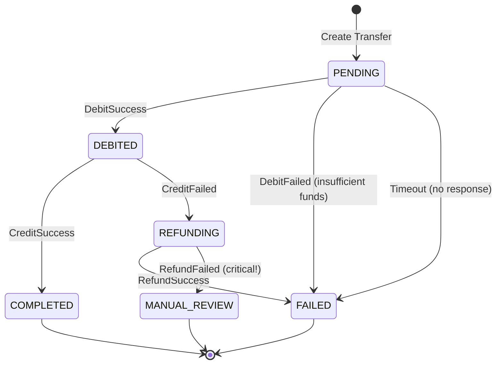
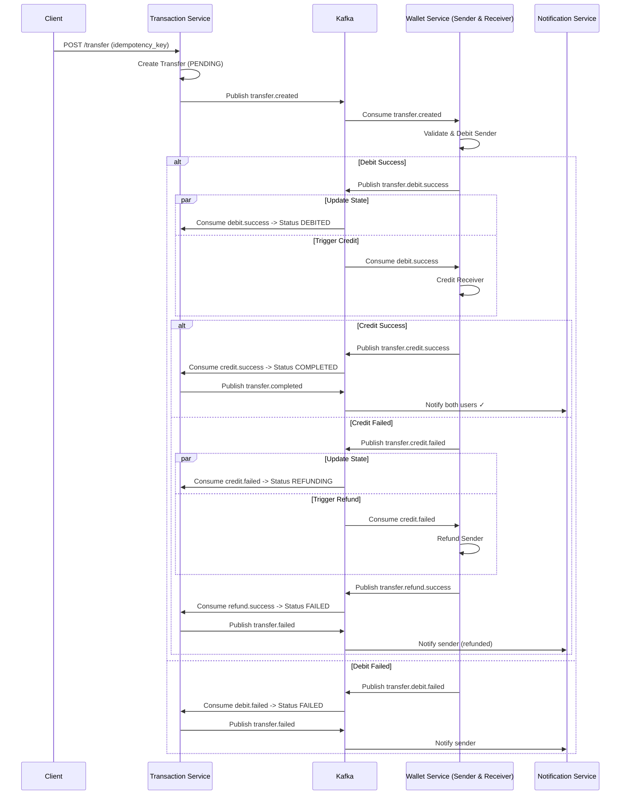
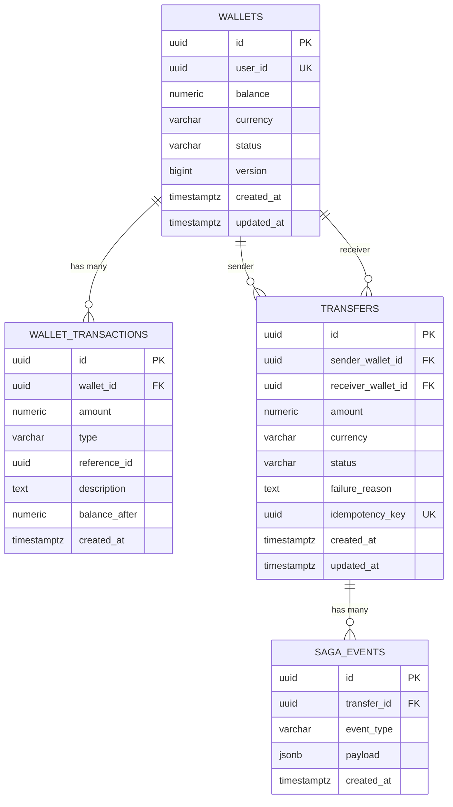

# SagaWallet: Distributed Wallet System
## Product Requirements Document (PRD)

---

## 1. Executive Summary

Go-Fintech is a high-performance, scalable, and consistent digital wallet infrastructure built using microservices architecture. The system implements the **Saga Choreography Pattern** to ensure distributed transaction consistency across services.

### Key Objectives
- 🎯 Build a production-ready distributed wallet system
- 🔄 Implement Saga Pattern for distributed transaction management
- ⚡ Achieve high throughput with Go's concurrency model
- 🏗️ Demonstrate modern microservices best practices

---

## 2. System Architecture

### 2.1 Microservices Overview

```
┌─────────────────────────────────────────────────────────────────┐
│                         API Gateway                              │
└─────────────────────────────────────────────────────────────────┘
                                │
        ┌───────────────────────┼───────────────────────┐
        ▼                       ▼                       ▼
┌───────────────┐     ┌─────────────────┐     ┌─────────────────┐
│    Wallet     │     │   Transaction   │     │  Notification   │
│    Service    │◄───►│     Service     │────►│    Service      │
│  (Go + Gin)   │     │   (Go + Gin)    │     │     (Go)        │
└───────┬───────┘     └────────┬────────┘     └─────────────────┘
        │                      │
        ▼                      ▼
┌───────────────┐     ┌─────────────────┐
│  PostgreSQL   │     │   PostgreSQL    │
│   (Wallets)   │     │ (Transactions)  │
└───────────────┘     └─────────────────┘
                                │
                    ┌───────────┴───────────┐
                    ▼                       ▼
              ┌──────────┐           ┌──────────┐
              │  Kafka   │◄─────────►│  Kafka   │
              │ Producer │           │ Consumer │
              └──────────┘           └──────────┘
```

### 2.2 Service Responsibilities

| Service | Responsibility | Database |
|---------|---------------|----------|
| **Wallet Service** | Balance management (credit/debit operations) | PostgreSQL |
| **Transaction Service** | Transaction history, transfer orchestration | PostgreSQL |
| **Notification Service** | Async user notifications | N/A (stateless) |

---

## 3. Technology Stack

| Component | Technology | Rationale |
|-----------|-----------|-----------|
| Language | Go (Golang) | 1.25 for high concurrency, low latency |
| Web Framework | Gin | Fast, lightweight, community support |
| Database | PostgreSQL + sqlc | Type-safe SQL code generation |
| Inter-service Communication | gRPC (Protocol Buffers) | Fast, schema-driven communication |
| Async Messaging | Kafka / Redpanda | Event-driven architecture, Saga support |
| Infrastructure | Terraform + GCP | Infrastructure as Code (Cloud Run) |
| Configuration | Viper | Environment variable management (supports PORT/DATABASE_URL) |

---

## 4. Core Features

### 4.1 Wallet Management
- **Create Wallet**: Register new user wallet
- **Get Balance**: Query current balance
- **Credit**: Add funds to wallet
- **Debit**: Withdraw funds (with balance validation)

### 4.2 Money Transfer (Saga Flow)

The transfer operation follows the **Saga Choreography pattern** with full compensation (rollback) support.

#### Saga State Machine



#### Complete Saga Sequence

#### Complete Saga Sequence (Choreography)



#### Saga Timeout Handling

If no response is received within the timeout period:

| State | Timeout | Action |
|-------|---------|--------|
| `PENDING` | 30s | Mark as `FAILED`, no compensation needed |
| `DEBITED` | 60s | Trigger refund, update to `REFUNDING` |
| `REFUNDING` | 120s | Escalate to `MANUAL_REVIEW`, alert ops team |

### 4.3 Transaction History
- View all transactions for a wallet
- Filter by status, date range, type

### 4.4 Notifications
- Real-time transaction status updates
- Async delivery via Kafka consumers

---

## 5. API Specifications

### 5.1 Wallet Service APIs

#### REST Endpoints (Gin)
| Method | Endpoint | Description |
|--------|----------|-------------|
| `POST` | `/api/v1/wallets` | Create new wallet |
| `GET` | `/api/v1/wallets/:id` | Get wallet details |
| `GET` | `/api/v1/wallets/:id/balance` | Get wallet balance |
| `POST` | `/api/v1/wallets/:id/credit` | Credit wallet |
| `POST` | `/api/v1/wallets/:id/debit` | Debit wallet |

#### gRPC Services
```protobuf
service WalletService {
  rpc GetBalance(GetBalanceRequest) returns (GetBalanceResponse);
  rpc Credit(CreditRequest) returns (CreditResponse);
  rpc Debit(DebitRequest) returns (DebitResponse);
}
```

### 5.2 Transaction Service APIs

| Method | Endpoint | Description |
|--------|----------|-------------|
| `POST` | `/api/v1/transfers` | Initiate transfer |
| `GET` | `/api/v1/transfers/:id` | Get transfer status |
| `GET` | `/api/v1/wallets/:id/transactions` | Get transaction history |

---

## 6. Data Models

> **Fintech Golden Rules:**
> 1. **Never use FLOAT** for money - use `NUMERIC` or `DECIMAL` for exact precision
> 2. **Optimistic Locking** - use `version` column to prevent race conditions
> 3. **Audit Everything** - maintain transaction logs for compliance

### 6.1 Wallet Service Schema

```sql
-- =====================
-- WALLET SERVICE SCHEMA
-- =====================

-- Main wallet table
CREATE TABLE wallets (
    id UUID PRIMARY KEY DEFAULT gen_random_uuid(),
    user_id UUID NOT NULL UNIQUE,
    balance NUMERIC(18, 2) NOT NULL DEFAULT 0.00,
    currency VARCHAR(3) NOT NULL DEFAULT 'TRY',
    status VARCHAR(20) NOT NULL DEFAULT 'ACTIVE' 
        CHECK (status IN ('ACTIVE', 'SUSPENDED', 'FROZEN', 'CLOSED')),
    version BIGINT NOT NULL DEFAULT 1,  -- Optimistic locking
    created_at TIMESTAMPTZ DEFAULT NOW(),
    updated_at TIMESTAMPTZ DEFAULT NOW()
);

-- Audit log for all balance changes (compliance requirement)
CREATE TABLE wallet_transactions (
    id UUID PRIMARY KEY DEFAULT gen_random_uuid(),
    wallet_id UUID NOT NULL REFERENCES wallets(id),
    amount NUMERIC(18, 2) NOT NULL,
    type VARCHAR(10) NOT NULL CHECK (type IN ('DEBIT', 'CREDIT')),
    reference_id UUID NOT NULL,  -- Links to Transfer in Transaction Service
    description TEXT,
    balance_after NUMERIC(18, 2) NOT NULL,  -- Snapshot for audit
    created_at TIMESTAMPTZ DEFAULT NOW()
);

-- Performance indexes
CREATE INDEX idx_wallets_user_id ON wallets(user_id);
CREATE INDEX idx_wallet_transactions_wallet_id ON wallet_transactions(wallet_id);
CREATE INDEX idx_wallet_transactions_reference_id ON wallet_transactions(reference_id);
CREATE INDEX idx_wallet_transactions_created_at ON wallet_transactions(created_at);
```

#### Optimistic Locking Usage
```sql
-- When updating balance, always check version hasn't changed
UPDATE wallets 
SET balance = balance - $1, 
    version = version + 1,
    updated_at = NOW()
WHERE id = $2 AND version = $3;

-- If 0 rows affected → concurrent modification detected, retry needed!
```

### 6.2 Transaction Service Schema

```sql
-- ===========================
-- TRANSACTION SERVICE SCHEMA
-- ===========================

-- Transfer records (Saga state machine)
CREATE TABLE transfers (
    id UUID PRIMARY KEY DEFAULT gen_random_uuid(),
    sender_wallet_id UUID NOT NULL,
    receiver_wallet_id UUID NOT NULL,
    amount NUMERIC(18, 2) NOT NULL CHECK (amount > 0),
    currency VARCHAR(3) NOT NULL DEFAULT 'TRY',
    status VARCHAR(20) NOT NULL DEFAULT 'PENDING' 
        CHECK (status IN ('PENDING', 'DEBITED', 'COMPLETED', 'REFUNDING', 'FAILED', 'MANUAL_REVIEW')),
    failure_reason TEXT,
    idempotency_key UUID UNIQUE,  -- Prevent duplicate transfers
    created_at TIMESTAMPTZ DEFAULT NOW(),
    updated_at TIMESTAMPTZ DEFAULT NOW()
);

-- Saga event log (for debugging and replay)
CREATE TABLE saga_events (
    id UUID PRIMARY KEY DEFAULT gen_random_uuid(),
    transfer_id UUID NOT NULL REFERENCES transfers(id),
    event_type VARCHAR(50) NOT NULL,
    payload JSONB NOT NULL,
    created_at TIMESTAMPTZ DEFAULT NOW()
);

-- Performance indexes
CREATE INDEX idx_transfers_sender ON transfers(sender_wallet_id);
CREATE INDEX idx_transfers_receiver ON transfers(receiver_wallet_id);
CREATE INDEX idx_transfers_status ON transfers(status);
CREATE INDEX idx_transfers_created_at ON transfers(created_at);
CREATE INDEX idx_saga_events_transfer_id ON saga_events(transfer_id);
```

### 6.3 Entity Relationship Diagram



---

## 7. Kafka Design

### 7.1 Topic Naming Convention

```
<domain>.<entity>.<action>
```

| Topic Name | Producer | Consumer | Description |
|------------|----------|----------|-------------|
| `transfer.created` | Transaction | Wallet | Saga Start: Request to debit sender |
| `transfer.debit.success` | Wallet | Txn, Wallet | Debit done. Action: Trigger Credit |
| `transfer.debit.failed` | Wallet | Txn | Debit failed. Action: End Saga |
| `transfer.credit.success` | Wallet | Txn | Credit done. Action: End Saga |
| `transfer.credit.failed` | Wallet | Txn, Wallet | Credit failed. Action: Trigger Refund |
| `transfer.refund.success` | Wallet | Txn | Refund done. Action: End Saga |
| `transfer.completed` | Transaction | Notification | Saga Completed successfully |
| `transfer.failed` | Transaction | Notification | Saga Failed |
| `transfer.dlq` | Any | Ops/Alerting | Dead letter queue |

### 7.2 Event Payload Schema

```json
{
  "eventId": "uuid",
  "eventType": "transfer.debit.requested",
  "timestamp": "2026-01-12T14:00:00Z",
  "version": "1.0",
  "correlationId": "uuid (transfer_id)",
  "payload": {
    "transferId": "uuid",
    "walletId": "uuid",
    "amount": "100.00",
    "currency": "TRY"
  },
  "metadata": {
    "source": "transaction-service",
    "retryCount": 0
  }
}
```

### 7.3 Partitioning Strategy

| Topic | Partition Key | Rationale |
|-------|---------------|----------|
| `transfer.debit.*` | `sender_wallet_id` | Ensures ordering per sender |
| `transfer.credit.*` | `receiver_wallet_id` | Ensures ordering per receiver |
| `transfer.completed/failed` | `transfer_id` | Group by transaction |

### 7.4 Dead Letter Queue (DLQ)

Failed messages after max retries are sent to `transfer.dlq`:

```json
{
  "originalTopic": "transfer.debit.requested",
  "originalEvent": { ... },
  "error": "Wallet not found",
  "failedAt": "2026-01-12T14:05:00Z",
  "retryCount": 3
}
```

**DLQ Processing & Worker:**
- **DLQ Worker**: A dedicated background worker processes failed messages from the `dlq` topic.
- **Observability**: Alerts are triggered for non-recoverable failures.
- **Auto-retry**: Exponential backoff for transient errors (network, temporary service downtime).
- **Manual intervention**: Permanent failures are logged for manual review.

### 7.5 Retry Strategy

| Attempt | Delay | Total Wait |
|---------|-------|------------|
| 1 | Immediate | 0s |
| 2 | 1s | 1s |
| 3 | 5s | 6s |
| 4 | 30s | 36s |
| 5 | 2min | ~2.5min |
| DLQ | - | After 5 failures |

---

## 8. Project Structure

> Based on [golang-standards/project-layout](https://github.com/golang-standards/project-layout) - the industry standard for Go projects.

```
go-fintech/
├── api/                              # gRPC & API definitions
│   └── proto/
│       ├── wallet/
│       │   └── wallet.proto
│       └── transaction/
│           └── transaction.proto
│
├── build/                            # Build & packaging
│   └── docker/
│       ├── wallet-service.Dockerfile
│       ├── transaction-service.Dockerfile
│       └── notification-service.Dockerfile
│
├── deployments/                      # Infrastructure as Code
│   └── terraform/
│       ├── main.tf
│       ├── variables.tf
│       └── modules/
│           ├── ecs/
│           ├── rds/
│           └── msk/                  # Managed Kafka
│
├── pkg/                              # Shared libraries across services
│   ├── kafka/                        # Common Kafka client wrapper
│   │   ├── producer.go
│   │   └── consumer.go
│   ├── config/                       # Shared Viper configuration
│   │   └── config.go
│   ├── errors/                       # Common error types
│   │   └── errors.go
│   └── models/                       # Shared domain models
│       └── events.go                 # Kafka event structures
│
├── services/
│   ├── wallet-service/
│   │   ├── cmd/
│   │   │   └── main.go               # Application entry point
│   │   ├── internal/
│   │   │   ├── handler/              # HTTP/Gin handlers
│   │   │   ├── service/              # Business logic layer
│   │   │   ├── repository/           # Database operations
│   │   │   └── grpc/                 # gRPC server implementation
│   │   ├── db/
│   │   │   ├── migrations/           # SQL migration files
│   │   │   │   ├── 001_create_wallets.up.sql
│   │   │   │   └── 001_create_wallets.down.sql
│   │   │   ├── queries/              # sqlc query files
│   │   │   │   └── wallets.sql
│   │   │   ├── sqlc.yaml
│   │   │   └── generated/            # sqlc generated code
│   │   ├── config/
│   │   │   └── config.yaml           # Service-specific config
│   │   └── go.mod
│   │
│   ├── transaction-service/
│   │   ├── cmd/
│   │   │   └── main.go
│   │   ├── internal/
│   │   │   ├── handler/
│   │   │   ├── service/
│   │   │   ├── repository/
│   │   │   ├── grpc/                 # gRPC client for Wallet Service
│   │   ├── db/
│   │   │   ├── migrations/
│   │   │   ├── queries/
│   │   │   ├── sqlc.yaml
│   │   │   └── generated/
│   │   ├── config/
│   │   └── go.mod
│   │
│   └── notification-service/
│       ├── cmd/
│       │   └── main.go
│       ├── internal/
│       │   ├── consumer/             # Kafka event consumers
│       │   └── notifier/             # Notification delivery
│       │       ├── email.go
│       │       ├── push.go
│       │       └── sms.go
│       ├── config/
│       └── go.mod
│
├── scripts/                          # Build, install, analysis scripts
│   ├── generate-proto.sh             # Generate Go code from protos
│   ├── migrate.sh                    # Run DB migrations
│   └── seed.sh                       # Seed test data
│
├── docker-compose.yml                # Local development stack
├── docker-compose.test.yml           # Integration test stack
├── Makefile                          # Common commands
├── go.work                           # Go workspace file (Go 1.18+)
├── .env.example                      # (Optional) Docker Compose env template
└── README.md
```

### Key Design Decisions

| Directory | Purpose |
|-----------|---------|
| `pkg/` | Shared code that all services import (Kafka, config, errors) |
| `db/migrations/` | Versioned SQL migrations (golang-migrate compatible) |
| `db/queries/` | sqlc query definitions separate from migrations |
| `db/generated/` | Auto-generated sqlc Go code (gitignored or committed) |
| `scripts/` | Automation scripts for common tasks |
| `go.work` | Go workspace for multi-module development |

---

## 9. Error Handling

### 9.1 Standardized Error Response

All APIs return errors in this format:

```json
{
  "error": {
    "code": "WALLET_NOT_FOUND",
    "message": "Wallet with ID xyz not found",
    "details": {
      "wallet_id": "xyz"
    },
    "request_id": "req-abc-123"
  }
}
```

### 9.2 Error Codes

| Code | HTTP Status | Description |
|------|-------------|-------------|
| `WALLET_NOT_FOUND` | 404 | Wallet does not exist |
| `WALLET_FROZEN` | 403 | Wallet is frozen/suspended |
| `INSUFFICIENT_FUNDS` | 400 | Balance too low for debit |
| `DUPLICATE_TRANSFER` | 409 | Idempotency key already used |
| `TRANSFER_NOT_FOUND` | 404 | Transfer does not exist |
| `INVALID_AMOUNT` | 400 | Amount must be positive |
| `INVALID_CURRENCY` | 400 | Currency not supported |
| `CONCURRENT_MODIFICATION` | 409 | Optimistic lock failed, retry |
| `SERVICE_UNAVAILABLE` | 503 | Downstream service down |
| `INTERNAL_ERROR` | 500 | Unexpected server error |

### 9.3 Circuit Breaker Pattern

```go
// Using sony/gobreaker
breaker := gobreaker.NewCircuitBreaker(gobreaker.Settings{
    Name:        "wallet-service",
    MaxRequests: 5,              // Max requests in half-open state
    Interval:    10 * time.Second,
    Timeout:     30 * time.Second,
    ReadyToTrip: func(counts gobreaker.Counts) bool {
        return counts.ConsecutiveFailures > 5
    },
})
```

---

## 10. Authentication & Authorization

### 10.1 JWT-Based Authentication

All API requests require a valid JWT token in the `Authorization` header:

```
Authorization: Bearer <jwt_token>
```

#### JWT Payload
```json
{
  "sub": "user-uuid",
  "wallet_id": "wallet-uuid",
  "roles": ["user"],
  "iat": 1704888000,
  "exp": 1704974400
}
```

### 10.2 API Key for Service-to-Service

Internal gRPC calls use API keys:

```
X-API-Key: <service_api_key>
```

### 10.3 Authorization Rules

| Operation | Rule |
|-----------|------|
| View wallet | User owns the wallet |
| Credit | User owns the wallet |
| Debit | User owns the wallet |
| Transfer | User owns sender wallet |
| View transfer | User is sender or receiver |

### 10.4 Rate Limiting

| Endpoint | Limit | Window |
|----------|-------|--------|
| `POST /transfers` | 100 | per minute |
| `POST /wallets/:id/credit` | 50 | per minute |
| `POST /wallets/:id/debit` | 50 | per minute |
| `GET *` | 1000 | per minute |

---

## 11. Observability

### 11.1 Structured Logging

All logs are in JSON format and include `trace_id` and `span_id` for distributed tracing.

### 11.2 Distributed Tracing (OpenTelemetry)

The system uses OpenTelemetry for end-to-end tracing across services. Traces are propagated via gRPC headers and Kafka event headers. 

In production (GCP), traces are exported to **Google Cloud Trace**. This allows visualizing the full path of a transfer from the Transaction Service to the Wallet Service and back.

---

### 11.3 Metrics (Prometheus)

| Metric | Type | Description |
|--------|------|-------------|
| `http_requests_total` | Counter | Total HTTP requests |
| `http_request_duration_seconds` | Histogram | Request latency |
| `transfer_status` | Gauge | Transfers by status |
| `wallet_balance` | Gauge | Current balances (sampled) |
| `kafka_messages_processed` | Counter | Kafka events processed |
| `saga_duration_seconds` | Histogram | End-to-end saga time |

### 11.4 Health Check Endpoints

| Endpoint | Description |
|----------|-------------|
| `GET /health` | Basic liveness check |
| `GET /ready` | Readiness (DB + Kafka connected) |

```json
{
  "status": "healthy",
  "version": "1.0.0",
  "checks": {
    "database": "ok",
    "kafka": "ok"
  }
}
```

---

## 12. Development Milestones

### Phase 1: Project Setup (Week 1)
- [x] Initialize Go workspace (`go.work`) and module structure
- [x] Create shared `pkg/` libraries (config, errors, models)
- [x] Set up Docker Compose (PostgreSQL, Kafka, Zookeeper)
- [x] Configure proto definitions and generate Go code
- [x] Create Makefile with common commands
- [x] Set up structured logging (zerolog/zap)

### Phase 2: Wallet Service (Week 2)
- [x] Database migrations and sqlc setup
- [x] Repository layer (CRUD + optimistic locking)
- [x] Business logic with error handling
- [x] HTTP handlers (Gin) with validation
- [x] gRPC server implementation
- [x] Kafka producer/consumer for saga events
- [x] Health check endpoints
- [x] Unit tests

### Phase 3: Transaction Service (Week 3)
- [x] Database migrations for transfers + saga_events
- [x] Repository layer
- [x] Transfer API endpoints
- [x] Saga state tracking (via Kafka consumers)
- [x] Saga timeout handler (cron job)
- [x] Kafka event handling (all saga events)
- [x] gRPC client for Wallet Service
- [x] Health check endpoints
- [x] Unit tests

### Phase 4: Notification Service (Week 4)
- [x] Kafka consumer setup (consumer group)
- [x] Notification delivery logic (mock/log)
- [x] Health check endpoints
- [x] Unit tests

### Phase 5: Cross-Cutting Concerns (Week 5)
- [x] JWT authentication middleware
- [x] Rate limiting middleware
- [x] Circuit breaker for inter-service calls
- [x] OpenTelemetry tracing setup
- [x] Prometheus metrics
- [x] DLQ processing job

### Phase 6: Infrastructure & Deployment (Week 6)
- [x] Dockerfiles for all services
- [x] Docker Compose for full stack
- [x] Terraform GCP configuration (Cloud Run, VPC, Cloud SQL)
- [x] CI/CD pipeline (GitHub Actions)
- [x] Migration to Go 1.25
- [x] OpenTelemetry integration with GCP Trace

### Phase 7: Testing & Documentation (Week 7)
- [ ] Integration tests for full Saga flow
- [ ] Load testing (k6 or vegeta)
- [ ] API documentation (Swagger/OpenAPI)
- [ ] README with setup instructions
- [ ] Architecture decision records (ADRs)

---

## 13. Success Metrics

| Metric | Target |
|--------|--------|
| API Response Time (p99) | < 100ms |
| Transfer Completion Rate | > 99.9% |
| System Availability | 99.95% |
| Transaction Throughput | > 1000 TPS |

---

## 14. Risks & Mitigations

| Risk | Mitigation |
|------|------------|
| Saga failure recovery | Implement compensation logic and dead letter queues |
| Kafka message ordering | Use partition keys based on wallet ID |
| Database consistency | Use transactions with proper isolation levels |
| Service failures | Implement health checks and circuit breakers |

---

## 15. Next Steps

1. **Review this PRD** - Confirm requirements and scope
2. **Initialize project structure** - Set up Go workspace
3. **Start with Wallet Service** - Foundation for all operations
4. **Iterate based on feedback** - Continuous improvement

---

> **Document Version**: 1.1  
> **Last Updated**: 2026-01-12  
> **Author**: Development Team
